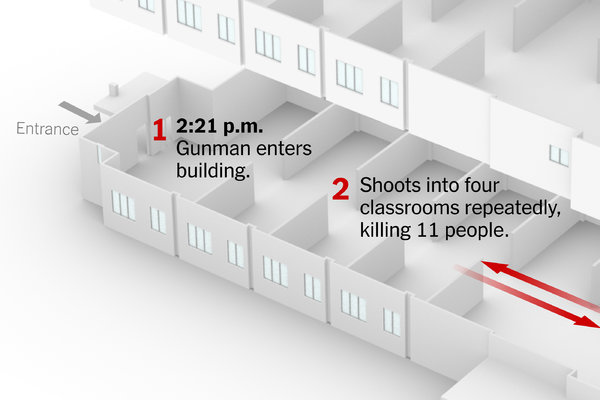

<style>
body{
  font-family: 'Verdana', Georgia;
  font-size: 15px;
  line-height: 25px;
}

h1,h3,h4 {
  font-family: 'Helvetica', Georgia;
}

h1{
  background-color: gray;
  color: #FFFFFF;
  text-shadow: 2px 2px 4px #000000;
  font-family: 'Impact', Georgia;
  padding: 20px;
  text-align: center;
}

.container { width: 1000px; }

h2{
  background-color: #337ab7;
  color: #FFFFFF;
  font-family: 'Heletica', Georgia;
  text-shadow: 1px 1px 2px #000000;
  font-weight: bolder;
  text-indent: 100px; 
}
</style>

```{r setup, include=FALSE}
library(knitr)
knitr::opts_chunk$set(echo = F)
source("analysis.R")
```


################################################################################
## Summary information
################################################################################

### About the dataset

The 2018 Mass Shootings dataset describes events in where people were killed or injured by a gunner. The 2018 total observed shootings are **`r num_shootings`** , where the mean injuries were **`r mean_injured`**, with a max of **`r lives_injured`** and the mean deaths were **`r mean_lost`**, with a max of **`r lives_lost`** . Altogether, the impact, represented by the total **`r dead_and_injured`** , directly affected dead_and_injured people; not to mention the victim's loved ones.


### The most impacted cities were:
`r most_impacted_cities`.

### The most impacted states were:
`r most_impacted_states`


################################################################################
## Summary Table
################################################################################

The following table summarizes the states with the highest number of injured people. It describes the exact location where the incident took place, and those killed or injured. To represent these findings, the dataset was first reduced to only these variable names. Then the table was arranged by the number of injured people, in descending order. The highest injuries happened in **`r summary_table[1,2:1]`**.

### Most Injured People
```{r}
kable(summary_table, row.names = NA, col.names = c(
  "State", "City",
  "People Killed", "People Injured"
), caption = "*The following table is arranged
by descending injuries")
```


################################################################################
## Particular incident
################################################################################

On **`r most_killed_incident[1,1]`**, The Parkland, Florida High School(**`r most_killed_incident[1,4]`**) suffered an unpresendented loss of life. The gunner, _Nikolas Cruz_, had already made threats using  social media but unfortunately was not arrest sooner. Ultimately, **`r most_killed_incident[1,5]`** were lost, which along with the injurires totaled to an incredible **`r (most_killed_incident[1,5] + most_killed_incident[1,6])`** "impacted" victims.

Credit: [NYT: Death Toll Is at 17 and Could Rise in Florida School Shooting](https://www.nytimes.com/2018/02/14/us/parkland-school-shooting.html)


### The following incident has the highest deaths observed.
```{r paged.print=TRUE}
kable(most_killed_incident, row.names = NA, col.names = c(
  "Date", "State",
  "City", "Address", "People Killed", "People Injured"
), caption = "*The following
incident calculated the max value of people killed")
```


################################################################################
## Interactive map
################################################################################

The map below shows all the observations of the 2018 Mass Shootings dataset using points on the continental USA. Here, every point represents an incident where the size is proportioned by the total lives lost at the given location. There are 4 major locations where 10 or more people were killed. Each point, once clicked, shows the date and the total people killed or injured.

**Click the points to interact with the map**

``` {r}
interactive_map
```


################################################################################
## A plot of your choice
################################################################################

Here, the impact (deaths and injuries) of shootings across all 12 months is represented by a bar graph. The Y asix is the amount of victims of either injurires or deaths and the X axis is the months of the year. While, a timeline could have shown the monthly trend of impacted people, it would have been less apparent to compare the number of people killed with the total impact. So, the legend of people killed, to the right, is useful since it indicates what months had the most deaths, compared to injuries.

``` {r}
shootings_months_graph
```

Thanks for reading!